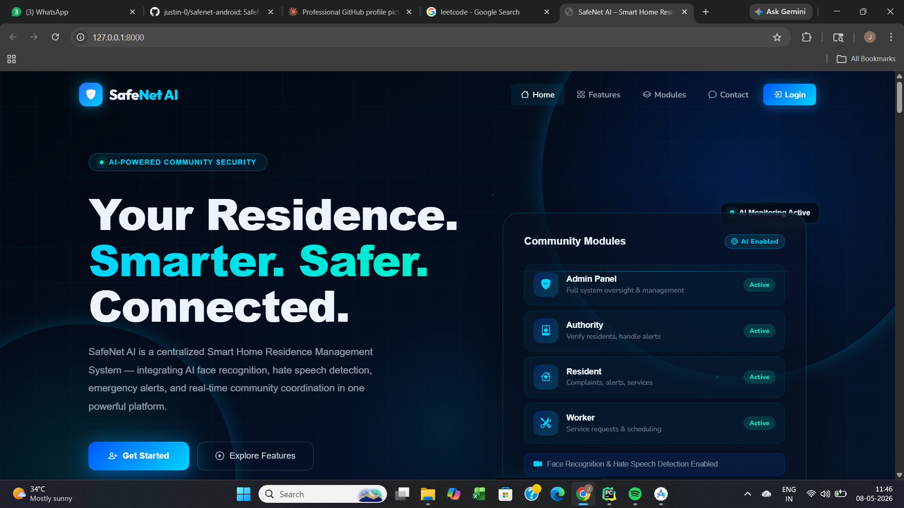
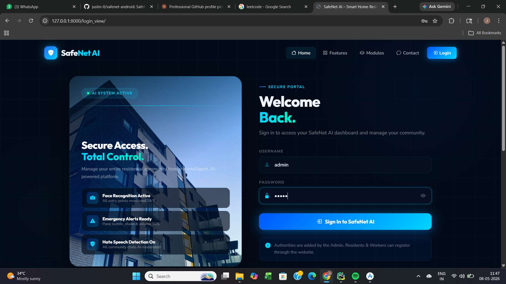
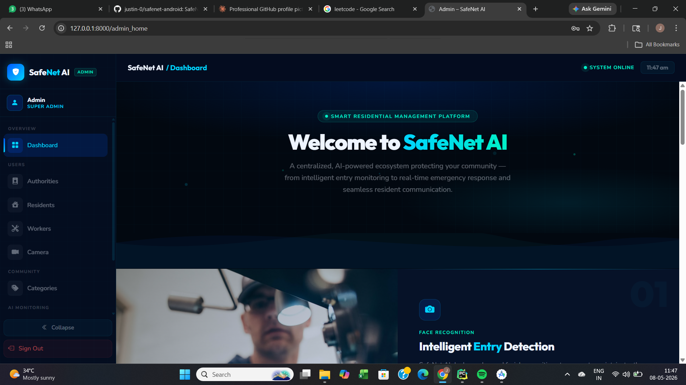
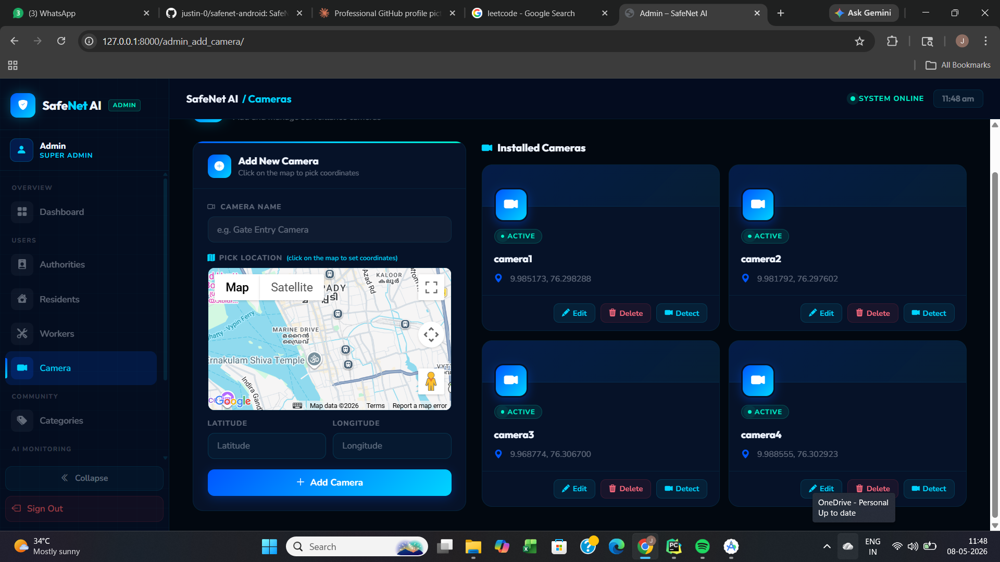

# 🛡️ SafeNet AI — Smart Home Residence Management System

SafeNet AI is a centralized Smart Home Residence Management System designed to enhance safety, communication, and service management within residential communities. It integrates AI-powered face recognition, hate speech detection, and emergency alert systems into a unified digital platform.

---

## 📸 Screenshots

| | |
|---|---|
| **🏠 Landing Page** | **🔐 Login Page** |
|  |  |
| **👮 Admin Dashboard** | **📷 Camera Management** |
|  |  |
| **💬 Authority Chat (AI Moderated)** | |
|  | |

---

## 🚀 Features

### 👤 Admin Module
- Manage Authorities, Residents, Workers
- Manage Categories & Cameras
- View Stray Dog Alerts & Unauthorized Entry Logs
- AI Face Recognition for entry monitoring

### 🏛️ Authority Module
- Verify Residents & Workers
- Handle Complaints & Send Replies
- Chat with Residents (AI Hate Speech Detection)
- View Live Alerts

### 🏠 Resident Module
- Register & Login
- Submit Complaints to Authority
- Chat with Authority (AI Moderated)
- Manage Family Members
- Request Services from Workers
- 🚨 Emergency Alert (Panic Button / Volume Button / Shake Detection)
- Report Stray Dog Alerts

### 👷 Worker Module
- Register & Login (after approval)
- View & Manage Service Requests
- Update Request Status

---

## 🤖 AI Features

- 🎭 **Face Recognition** — Detects unauthorized entry at camera points
- 💬 **Hate Speech Detection** — Monitors all chat communications in real time
- 🐕 **Stray Dog Detection** — AI-powered alert system for stray animals
- 🚨 **Emergency Alerts** — Triggered via panic button, volume button, or shake gesture

---

## 🛠️ Tech Stack

| Layer | Technology |
|-------|-----------|
| Backend | Python, Django 5.2 |
| Frontend | HTML, CSS, Bootstrap, JavaScript |
| Mobile App | Flutter (Android) |
| Database | MySQL |
| AI - Face Recognition | OpenCV, Deep Learning |
| AI - Hate Speech Detection | PyTorch, Transformers |
| Maps | Google Maps API |

---

## ⚙️ How to Run Locally

### Prerequisites
- Python 3.12
- MySQL
- pip

### Steps

**1. Clone the repository**
```bash
git clone https://github.com/justin-0/safenet-web.git
cd safenet-web
```

**2. Install dependencies**
```bash
pip install -r requirements.txt
```

**3. Create `.env` file in root folder**


**4. Create MySQL database**
```sql
CREATE DATABASE safenet_ai;
```

**5. Run migrations**
```bash
python manage.py migrate
```

**6. Run the server**
```bash
python manage.py runserver
```

**7. Open in browser**

---

## 📱 Mobile App

The Flutter Android app repository is available here:
👉 [safenet-android](https://github.com/justin-0/safenet-android)

---

## 👨‍💻 Developer

**Justin**
- 🎓 BCA Graduate
- 💼 1 Year Experience as Junior Software Developer

---

## 📄 License

This project is for educational purposes.
